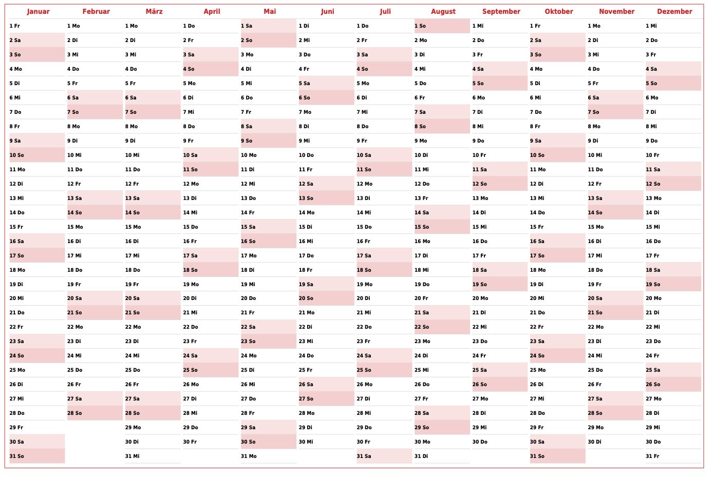

# CalendarGenerator
[](https://php.net/)
[](https://sonarcloud.io/summary/new_code?id=lugark_calendar-pdf-renderer)
[](https://sonarcloud.io/summary/new_code?id=lugark_calendar-pdf-renderer)
[](https://sonarcloud.io/summary/new_code?id=lugark_calendar-pdf-renderer)


This library aims to have a flexible way to render a calendar

## Dependencies
- PHP 8.1 or higher
- Symfony 6.4
- [nesbot/carbon](https://github.com/briannesbitt/carbon) to iterate/calculate calendar data
- [mpdf/mpdf](https://github.com/mpdf/mpdf) to generate the PDF

## Installaion
```
composer require lugark/calendar-pdf-renderer-bundle
```

## Usage
Examples can be found in the examples directory.

### Rendering the Calendar
To render a calendar you need to create a render request object. This contains all required information.
- Type of the calendar to render
- Startdate of the calendar (DateTime)
```
$renderRequest = new RenderRequest(
        LandscapeYear::class,
        new DateTime('2021-01')
    );
```

The request is passed to the render service that creates the pdf:
```
/**
 * Render the request!
 * Default output is the root directory with a filename "calendar.pdf"
 */
$renderer = new CalendarRenderer();
$renderer->renderCalendar($renderRequest);
```

